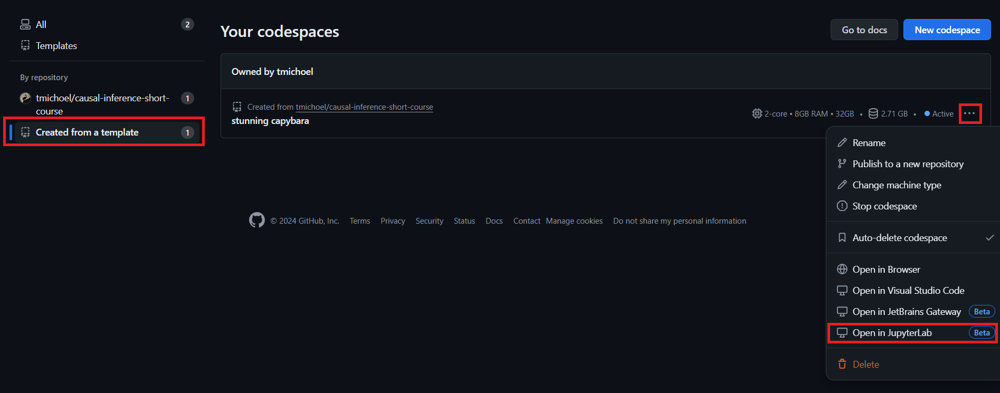

# Causal Inference in Drug Discovery Short Course

This repository will contain lecture notes and example notebooks for the short course on causal inference in drug discovery during the [NOVAMATH Thematic Weeks 2024](https://eventos.fct.unl.pt/novamath_thematic_weeks/). 

## Course content

The course will roughly follow our [review on causal inference in drug discovery and development](https://doi.org/10.1016/j.drudis.2023.103737). To discover new drugs is to seek and prove causality. Causal inference combines model and data to identify causations from correlations and is indispensable for  intervention, "what if" questions, and understanding. 

The first part of the course will introduce the basic concepts of causal modelling with directed acyclic graphs (DAGs), the identification and estimation of causal effects, and causal model selection. The second part of the course will focus on learning large-scale causal Bayesian networks from population genomics data and controlled perturbation experiments, and how such networks are used to understand mechanisms, identify candidate targets, and discover drug repurposing opportunities.

List of planned topics:

- What is causal inference?
- Causal inference with DAGs
- Common structural motifs in DAGs and how to interpret them
- Causal effect identification using the backdoor and frontdoor criteria
- Causal effect estimation from data
- Statistical model selection
- Mendelian randomization
- Bayesian network learning
- Population genomics data resources
- Controlled perturbation experiments resources
- Drug repurposing methods


## Software installation

The example notebooks are written in [Julia][1], an open-source programming language that combines the interactivity of [Python](https://www.python.org/), [R](https://www.r-project.org/) and [Matlab](https://mathworks.com), with the speed of [C](https://en.wikipedia.org/wiki/C_(programming_language)). Read more about its design principles and why it is good for scientific applications, including computational biology here:

- [Why we created Julia](https://julialang.org/blog/2012/02/why-we-created-julia/)
- [Julia: come for the syntax, stay for the speed](https://www.nature.com/articles/d41586-019-02310-3)
- [Julia for biologists](https://www.nature.com/articles/s41592-023-01832-z)

[Julia][1] is also the language behind [PumasAI](https://pumas.ai/).

To run the notebooks, you have two options:

- Run everything inside a [Github Codespace](https://github.com/features/codespaces)
- Install Julia and reproduce the state of this repository locally

> [!IMPORTANT]  
> If you don't have a Github account yet, you need to [sign up](https://github.com/signup) for one. Note that Github offers [extra benefits to registered students](https://github.com/edu/students):

### Using Github Codespaces

#### **Create you Codespace**

> [!IMPORTANT]  
> This step takes quite some time and it is recommended to do this **before the start of the course**!

1. On the [repository homepage](https://github.com/tmichoel/causal-inference-short-course), find the **Use this template button** (top right of the page), and select **Open in a codespace**.
2. A new [Visual Studio Code](https://code.visualstudio.com/) window will open in the browser. A Terminal named "Github Codespaces: Details" may appear showing lots of commands being executed.
3. Now would be a good time to go for a :coffee:
4. Once the Codespace creation has concluded, the window can be safely closed.


#### **Use your Codespace **

1. Go to [github.com/codespaces](https://github.com/codespaces). In the left-hand menu, you should see an entry **Created from a template**. Click on it.
2. Click on the `...` on the right-hand side to open a menu (see figure).
3. Click **Open in JupyterLab**



> [!IMPORTANT]  
> Remember to click **Stop codespace** in the same menu (see figure) between sessions, otherwise it will keep running in the background and use up your free quota of compute time. When you come back for the next session, you can simply click **Open in JupyterLab** again to resume your work.

> [!WARNING]
> Do not use the *Delete* button, otherwise you will lose any changes *and* have to create a new Codespace.

> [!TIP]
> It is recommended to **make a copy of the notebook files** before you start working with them. This will allow to pull any updates I make to the repository into your codespace without any merge conflicts.

### Local installation


### **Clone or fork the repository**

Download this code base or [fork](https://docs.github.com/en/pull-requests/collaborating-with-pull-requests/working-with-forks/fork-a-repo) the repository. Make sure to [sync your fork](https://docs.github.com/en/pull-requests/collaborating-with-pull-requests/working-with-forks/syncing-a-fork) regularly to make sure it remains up-to-date! Notice that raw data are typically not included in the git-history and need to be downloaded independently. 

> [!TIP]
> It is recommended to **make a copy of the notebook files** before you start working with them. This will avoid conflicts between your and my changes when you [sync your fork](https://docs.github.com/en/pull-requests/collaborating-with-pull-requests/working-with-forks/syncing-a-fork).


#### **Install Julia**

Follow the [installation instructions](https://github.com/JuliaLang/juliaup).


#### **Run Julia and instantiate (precompile) this project**

> [!IMPORTANT]  
> This step needs to be executed only once. It is the only time-consuming step and it is recommended to do this **before the start of the course**!

The repository code base uses [DrWatson](https://juliadynamics.github.io/DrWatson.jl/stable/) to make a reproducible scientific project named

> causal-inference-short-course

To (locally) reproduce this project, do the following:


Open a [Julia console](https://docs.julialang.org/en/v1/stdlib/REPL/) and do:
```
julia> using Pkg
julia> Pkg.add("DrWatson") # install globally, for using `quickactivate`
julia> Pkg.add("IJulia") # install globally
julia> Pkg.activate("path/to/this/project")
julia> Pkg.instantiate()
```

This will install all necessary packages for you to be able to run the scripts and notebooks and everything should work out of the box, including correctly finding local paths.

You may notice that most scripts and notebooks start with the commands:
```julia
using DrWatson
@quickactivate "causal-inference-short-course"
```
which auto-activate the project and enable local path handling from DrWatson.

#### **Run Julia and start JupyterLab**

The previous step needs to be executed only once. For all subsequent sessions:

Open a [Julia console](https://docs.julialang.org/en/v1/stdlib/REPL/) and do:
```
julia> using Pkg
julia> Pkg.activate("path/to/this/project")
julia> using IJulia
julia> jupyterlab(detached=true)
```

This should start a familiar [JupyterLab](https://jupyterlab.readthedocs.io/) session.

[1]: https://julialang.org/
[2]: https://plutojl.org/
[3]: https://juliahub.com/

## Data download

Download toy data from [this OneDrive link](https://universityofbergen-my.sharepoint.com/:f:/g/personal/tom_michoel_uib_no/En9yoe7k-ZFDv7K53FbOnHQB4v1tMCnBKg_lQF1iBM-4mQ?e=ZiKi4l).

The files in this folder should be stored exactly in the location:

```
path/to/this/project/data/processed/findr-data-geuvadis
```

